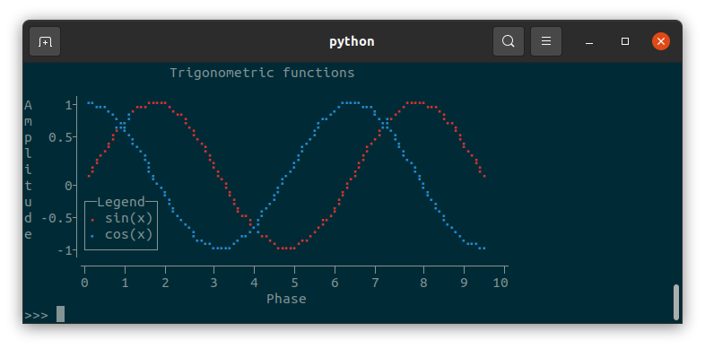

# tplot

[](https://tplot.readthedocs.io/en/latest/)
 
[](https://pypi.org/project/tplot/)

`tplot` is a Python module for creating text-based graphs. Useful for visualizing data to the terminal or log files.

## Features

- Scatter plots, line plots, horizontal/vertical bar plots, and image plots
- Supports numerical and categorical data
- Legend
- Unicode characters (with automatic ascii fallback if unicode is not supported)
- Colors (using ANSI escape characters, with Windows support)
- Few dependencies
- Fast and lightweight

## Installation

`tplot` is available on [PyPi](https://pypi.org/project/tplot/):

```bash
pip install tplot
```

## Documentation

Documentation is available on [readthedocs](https://tplot.readthedocs.io/en/latest/).

## Examples

### Basic usage

```python
import tplot

fig = tplot.Figure()
fig.scatter([0, 1, 2, 3, 4, 5, 6, 7, 8, 9, 10])
fig.show()
```


### A more advanced example

```python
import tplot
import numpy as np

x = np.linspace(start=0, stop=np.pi*3, num=80)

fig = tplot.Figure(
    xlabel="Phase",
    ylabel="Amplitude",
    title="Trigonometric functions",
    legendloc="bottomleft",
    width=60,
    height=15,
)
fig.line(x, y=np.sin(x), color="red", label="sin(x)")
fig.line(x, y=np.cos(x), color="blue", label="cos(x)")
fig.show()
```


