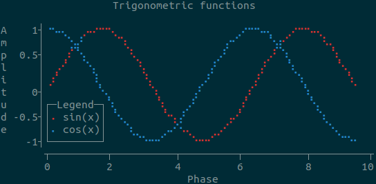

# tplot

`tplot` is a Python module for creating text-based graphs. Useful for visualizing data to the terminal or log files.

## Features

- Scatter plots, line plots, horizontal/vertical bar plots, and image plots
- Supports numerical and categorical data
- Legend
- Unicode characters (with automatic ascii fallback if unicode is not supported)
- Colors (using ANSI escape characters, with Windows support)
- Few dependencies
- Fast and lightweight

## Installation

`tplot` is available on [PyPi](https://pypi.org/project/tplot/):

```bash
pip install tplot
```

## Examples

### Basic usage

```python
import tplot

fig = tplot.Figure()
fig.scatter([0, 1, 2, 3, 4, 5, 6, 7, 8, 9, 10])
fig.show()
```

```text
10┤                                                                            •
  │                                                                             
  │                                                                    •        
  │                                                                             
 8┤                                                             •               
  │                                                                             
  │                                                     •                       
  │                                                                             
 6┤                                              •                              
  │                                                                             
  │                                      •                                      
  │                                                                             
 4┤                              •                                              
  │                                                                             
  │                       •                                                     
  │                                                                             
 2┤               •                                                             
  │                                                                             
  │        •                                                                    
  │                                                                             
 0┤•                                                                            
   ┬───────┬──────┬───────┬──────┬───────┬───────┬──────┬───────┬──────┬───────┬
   0       1      2       3      4       5       6      7       8      9      10

```

### A more advanced example

```python
import tplot
import numpy as np

x = np.linspace(start=0, stop=np.pi*3, num=80)

fig = tplot.Figure(
    xlabel="Phase",
    ylabel="Amplitude",
    title="Trigonometric functions",
    legendloc="bottomleft",
    width=60,
    height=15,
)
fig.line(x, y=np.sin(x), color="red", label="sin(x)")
fig.line(x, y=np.cos(x), color="blue", label="cos(x)")
fig.show()
```



### Categorical data

```python
import tplot

dish = ["pasta", "ice cream", "rice", "waffles", "pancakes"]
topping = ["cheese", "chocolate", "cheese", "chocolate", "chocolate"]

fig = tplot.Figure(width=60, height=6, title="Chocolate or cheese?", xticklabel_length=14)
fig.scatter(x=dish, y=topping, marker="X")
fig.show()
```

```text
                    Chocolate or cheese?                    
                                                            
chocolate┤X           X                                    X
   cheese┤                        X            X            
          ┬───────────┬───────────┬────────────┬───────────┬
      ice cream   pancakes      pasta        rice    waffles
```

## Markers

`tplot` allows you to use any single character as a marker:

```python
import tplot

fig = tplot.Figure()
fig.line([0,2,3,3.5,2,6.1,1.5,3], marker="♥")
fig.show()
```

```text
7┤                                                                              
 │                                                                              
 │                                                                              
6┤                                                       ♥                      
 │                                                      ♥ ♥                     
 │                                                     ♥   ♥                    
5┤                                                    ♥     ♥                   
 │                                                   ♥      ♥                   
 │                                                  ♥        ♥                  
4┤                                                 ♥          ♥                 
 │                            ♥♥♥♥♥♥♥             ♥            ♥                
3┤                     ♥♥♥♥♥♥♥       ♥♥♥         ♥              ♥             ♥♥
 │                 ♥♥♥♥                 ♥♥      ♥                ♥          ♥♥  
 │             ♥♥♥♥                       ♥♥♥  ♥                 ♥        ♥♥    
2┤           ♥♥                              ♥♥                   ♥     ♥♥      
 │         ♥♥                                                      ♥  ♥♥        
 │       ♥♥                                                         ♥♥          
1┤     ♥♥                                                                       
 │   ♥♥                                                                         
 │ ♥♥                                                                           
0┤♥                                                                             
  ┬──────────┬──────────┬──────────┬──────────┬──────────┬──────────┬──────────┬
  0          1          2          3          4          5          6          7
```

Be wary of using [fullwidth characters](https://en.wikipedia.org/wiki/Halfwidth_and_fullwidth_forms), because these will [mess up alignment](#character-alignment).

## Formatting issues

### Writing to a file and color support

You can get the figure as a string simply by converting to to the `str` type: `str(fig)`

However, if you have a figure with colors and you try to write it to a file (or copy and paste it from the terminal), you will find it looks all wrong:

```text
                  Trigonometric functions                   \n                                                            \nA    1┤\x1b[34m⠐\x1b[0m\x1b[34m⠢\x1b[0m\x1b[34m⠤\x1b[0m\x1b[34m⡀\x1b[0m  \x1b[31m⡠\x1b[0m\x1b[31m⠤\x1b[0m\x1b[31m⠒\x1b[0m\x1b[31m⠒\x1b[0m\x1b[31m⠢\x1b[0m\x1b[31m⡀\x1b[0m                   \x1b[34m⡠\x1b[0m\x1b[34m⠒\x1b[0m\x1b[34m⠒\x1b[0m\x1b[34m⠢\x1b[0m\x1b[34m⠤\x1b[0m\x1b[34m⡀\x1b[0m  \x1b[31m⡠\x1b[0m\x1b[31m⠒\x1b[0m\x1b[31m⠒\x1b[0m\x1b[31m⠢\x1b[0m\x1b[31m⠤\x1b[0m\x1b[31m⡀\x1b[0m        \nm     │   \x1b[34m⠈\x1b[0m\x1b[34m⣢\x1b[0m\x1b[34m⡜\x1b[0m     \x1b[31m⠈\x1b[0m\x1b[31m⠱\x1b[0m\x1b[31m⡀\x1b[0m               \x1b[34m⡔\x1b[0m\x1b[34m⠊\x1b[0m     \x1b[34m⠑\x1b[0m\x1b[34m⣴\x1b[0m\x1b[31m
⠊\x1b[0m     \x1b[31m⠘\x1b[0m\x1b[31m⠤\x1b[0m\x1b[31m⡀\x1b[0m      \np  0.5┤   \x1b[31m⡰\x1b[0m\x1b[31m⠁\x1b[0m\x1b[34m⠑
\x1b[0m\x1b[34m⡄\x1b[0m      \x1b[31m⠘\x1b[0m\x1b[31m⢄\x1b[0m            \x1b[34m⢀\x1b[0m\x1b[34m⠜\x1b[0m      \x1b[31m⢀
\x1b[0m\x1b[31m⠜\x1b[0m \x1b[34m⠱\x1b[0m\x1b[34m⡀\x1b[0m      \x1b[31m⠱\x1b[0m\x1b[31m⡀\x1b[0m     \nl     │ \x1b[31m⢀\x1b[0m\x1b[31m⠔\x1b[0m\x1b[31m⠁\x1b[0m  \x1b[34m⠈\x1b[0m\x1b[34m⢢\x1b[0m       \x1b[31m⢣\x1b[0m          \x1b[34m⢠\x1b[0m\x1b[34m⠃\x1b[0m      \x1b[31m⢠\x1b[0m\x1b[31m⠃\x1b[0m   \x1b[34m⠱\x1b[0m\x1b[34m⡀\x1b[0m      \x1b[31m⠑\x1b[0m\x1b[31m⢄
\x1b[0m    \ni     │\x1b[31m⢀\x1b[0m\x1b[31m⠎\x1b[0m      \x1b[34m⢇\x1b[0m       \x1b[31m⢣\x1b[0m        \x1b[34m⡠\x1b[0m\x1b[34m⠃\x1b[0m      \x1b[31m⢠\x1b[0m\x1b[31m⠃\x1b[0m     \x1b[34m⠈\x1b[0m\x1b[34m⢆\x1b[0m      \x1b[31m⠈\x1b[0m\x1b[31m⢆\x1b[0m   \nt    0┤        \x1b[34m⠈\x1b[0m\x1b[34m⠢\x1b[0m\x1b[34m⡀\x1b[0m      \x1b[31m⠱\x1b[0m\x1b[31m⡀\x1b[0m     \x1b[34m⡜\x1b[0m       \x1b[31m⡰\x1b[0m\x1b[31m⠁\x1b[0m       \x1b[34m⠈\x1b[0m\x1b[34m⢆\x1b[0m          \nu     │┌─Legend─┐\x1b[34m⠱\x1b[0m\x1b[34m⡀\x1b[0m      \x1b[31m⠱\x1b[0m\x1b[31m⡀\x1b[0m  \x1b[34m⢀\x1b[0m\x1b[34m⠜\x1b[0m       \x1b[31m⡰\x1b[0m\x1b[31m⠁\x1b[0m         \x1b[34m⠈\x1b[0m\x1b[34m⢢\x1b[0m         \nd -0.5┤│\x1b[31m⠄\x1b[0m sin(x)│ \x1b[34m
⠑\x1b[0m\x1b[34m⢄\x1b[0m      \x1b[31m⠑\x1b[0m\x1b[31m⢢\x1b[0m\x1b[34m⢠\x1b[0m\x1b[34m⠃\x1b[0m      \x1b[31m⢠\x1b[0m\x1b[31m⠔\x1b[0m\x1b[31m⠁\x1b[0m            \x1b[34m⠱\x1b[0m\x1b[34m⡀\x1b[0m       \ne     ││\x1b[34m⠄\x1b[0m cos(x)│   \x1b[34m⠱\x1b[0m\x1b[34m⣀\x1b[0m    \x1b[34m⡠\x1b[0m\x1b[34m⠔\x1b[0m\x1b[34m⠑\x1b[0m\x1b[31m⠤\x1b[0m\x1b[31m⡀\x1b[0m   \x1b[31m⣀\x1b[0m\x1b[31m⠔\x1b[0m\x1b[31m⠁\x1b[0m               \x1b[34m⠈\x1b[0m\x1b[34m⠢\x1b[0m\x1b[34m⡀\x1b[0m     \n    -1┤
└────────┘     \x1b[34m⠉\x1b[0m\x1b[34m⠒\x1b[0m\x1b[34m⠒\x1b[0m\x1b[34m⠊\x1b[0m    \x1b[31m⠈\x1b[0m\x1b[31m⠒\x1b[0m\x1b[31m⠒\x1b[0m\x1b[31m⠊\x1b[0m                    \x1b[34m⠈\x1b[0m\x1b[34m⠉\x1b[0m\x1b[34m⠒\x1b[0m   \n       ┬─────────┬──
────────┬─────────┬──────────┬─────────┬\n       0         2          4         6          8        10\n                              Phase                         
```

This is because `tplot` uses ANSI escape characters to display colors. ANSI escape characters allow terminals to display color, but don't work outside the terminal. Regular UTF-8 or unicode-encoded text files do not support colored text. If you want to write figures to a text file (e.g. for logging purposes), it is best to avoid the use of color.

### Converting to HTML

Alternatively, you can run the figure as a string through a tool such as [ansi2html](https://github.com/pycontribs/ansi2html) to format the figure using HTML:

```python
from ansi2html import Ansi2HTMLConverter

conv = Ansi2HTMLConverter(markup_lines=True)
html = conv.convert(str(fig))
with open("fig.html", "w") as f:
    f.write(html)
```

However, if you're using unicode characters (such as braille), you will probably run into character alignment issues.

### Character alignment

#### Fullwidth and halfwidth characters

`tplot` assumes all characters have a fixed width. Unless you're crazy, your terminal uses a monospace font. But even for monospaced fonts, the wondrous world of unicode has two character widths: halfwidth (so called because they are half as wide as they are tall) and fullwidth. Most characters you know are probably halfwidth. Many Asian languages such as Chinese, Korean, and Japanese use fullwidth characters. Emoji are usually also fullwidth.

Though fullwidth characters are exactly twice as wide as halfwidth characters, they still count as only one character. `tplot` will not stop you from using fullwidth characters, but it will mess up the alignment:

```
fig = tplot.Figure(width=80, height=6)
x = [0, 1, 2, 3, 4, 5]
fig.scatter(x, y=[1, 1, 1, 1, 1, 1], marker="#")
fig.scatter(x, y=[0, 0, 0, 0, 0, 0], marker="💩")
fig.show()
```

```text
1┤#              #               #              #               #              #
 │                                                                              
0┤💩              💩               💩              💩               💩              💩
  ┬───────┬──────┬───────┬───────┬──────┬───────┬───────┬───────┬──────┬───────┬
  0      0.5     1      1.5      2     2.5      3      3.5      4     4.5      5
```

#### Braille

`tplot` can use braille characters to subdivide characters into a 2x8 grid, increasing the resolution of the plot beyond what is possible with single characters. However, not all monospace fonts display braille characters the same. In Ubuntu's default terminal with the default Monospace Regular font, braille characters are rendered as halfwidth characters, so this will show a nice diagonal line:

```python
fig = tplot.Figure(width=40, height=12)
fig.line([0,1], marker="braille")
fig.show()
```

But many environments treat braille as somewhere in between halfwidth and fullwidth characters, leading to close-but-not-quite aligned plots:

```text
  1┤                                 ⣀⠤⠒
   │                            ⢀⡠⠤⠒⠉   
   │                        ⢀⡠⠔⠊⠁       
   │                    ⣀⠤⠒⠉⠁           
0.5┤               ⢀⡠⠔⠒⠉                
   │           ⣀⠤⠔⠊⠁                    
   │       ⣀⠤⠒⠉                         
   │  ⢀⡠⠔⠊⠉                             
  0┤⠐⠊⠁                                 
    ┬─────────────────┬────────────────┬
    0                0.5               1
```