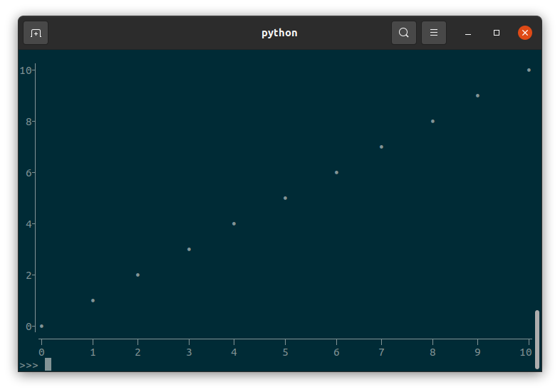
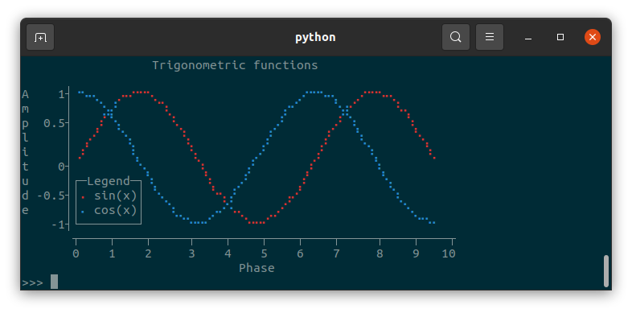
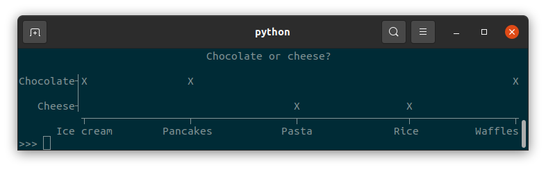
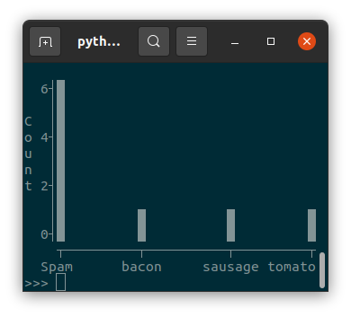
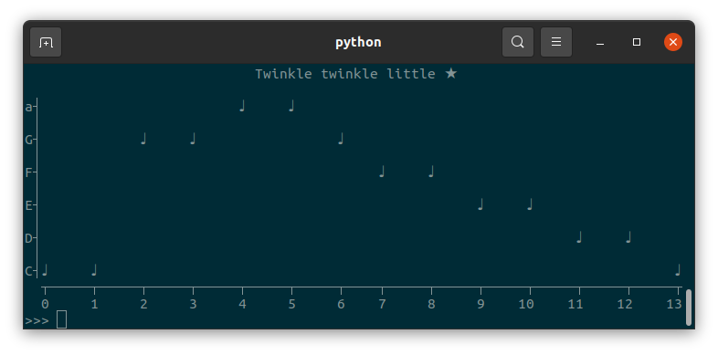
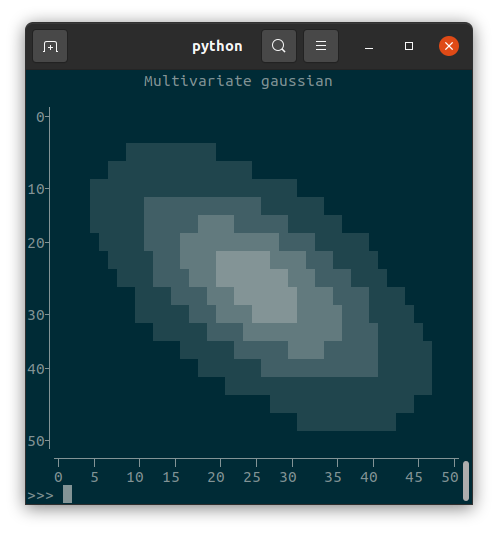
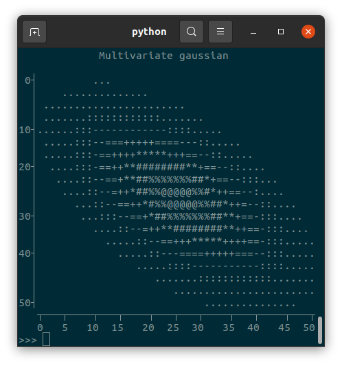
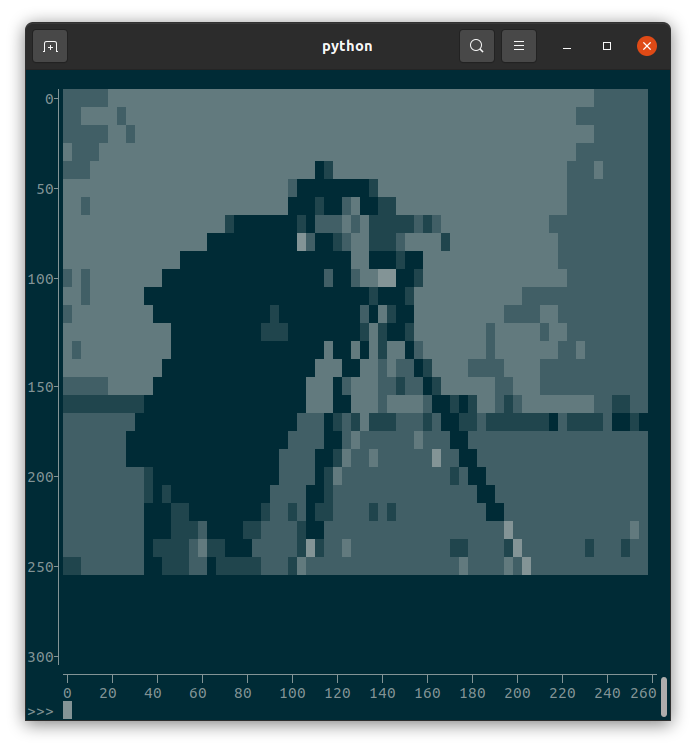
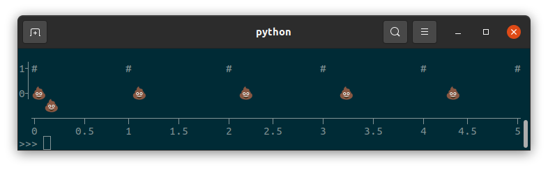
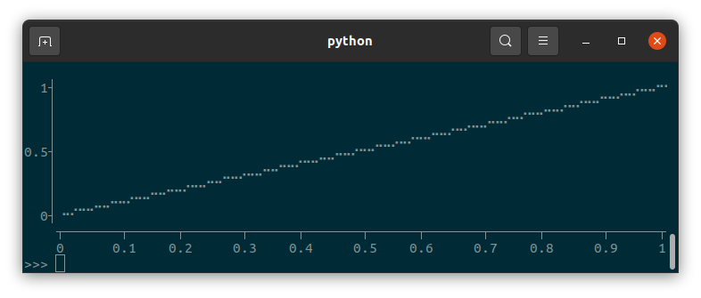

tplot
=====

.. toctree::
   :maxdepth: 2
   :caption: Contents:

``tplot`` is a Python package for creating text-based graphs. Useful for visualizing data to the terminal or log files.

Features
--------

* Scatter plots, line plots, horizontal/vertical bar plots, and image plots
* Supports numerical and categorical data
* Legend
* Unicode characters (with automatic ascii fallback)
* Colors
* Few dependencies
* Fast and lightweight
* Doesn't take over your terminal (only prints strings)

Installation
------------

``tplot`` is available on `PyPI <https://pypi.org/project/tplot/>`_:

.. code-block:: bash

   pip install tplot

Examples
========

Basic usage
-----------
::

   import tplot

   fig = tplot.Figure()
   fig.scatter([0, 1, 2, 3, 4, 5, 6, 7, 8, 9, 10])
   fig.show()

A more advanced example
-----------------------

::

   import tplot
   import numpy as np

   x = np.linspace(start=0, stop=np.pi*3, num=80)

   fig = tplot.Figure(
      xlabel="Phase",
      ylabel="Amplitude",
      title="Trigonometric functions",
      legendloc="bottomleft",
      width=60,
      height=15,
   )
   fig.line(x, y=np.sin(x), color="red", label="sin(x)")
   fig.line(x, y=np.cos(x), color="blue", label="cos(x)")
   fig.show()

Categorical data
----------------

``tplot`` supports categorical data in the form of strings::

   import tplot

   dish = ["Pasta", "Ice cream", "Rice", "Waffles", "Pancakes"]
   topping = ["Cheese", "Chocolate", "Cheese", "Chocolate", "Chocolate"]

   fig = tplot.Figure(height=7, title="Chocolate or cheese?")
   fig.scatter(x=dish, y=topping, marker="X")
   fig.show()

Numerical and categorical data can be combined in the same plot::

   from collections import Counter
   import tplot

   counter = Counter(
      ["Spam", "sausage", "Spam", "Spam", "Spam", "bacon", "Spam", "tomato", "Spam"]
   )

   fig = tplot.Figure(ylabel="Count")
   fig.bar(x=counter.keys(), y=counter.values())
   fig.show()

Markers
-------

``tplot`` allows you to use any single character as a marker::

   import tplot

   fig = tplot.Figure(title="Twinkle twinkle little ★")
   notes = ["C", "C", "G", "G", "a", "a", "G", "F", "F", "E", "E", "D", "D", "C"]
   fig.scatter(notes, marker="♩")
   fig.show()

.. warning::
   Be wary of using `fullwidth characters <https://en.wikipedia.org/wiki/Halfwidth_and_fullwidth_forms>`_, because these will mess up alignment (see :ref:`character-alignment-issues`).

Images (2D arrays)
------------------

``tplot`` can visualize 2D arrays using a few different "colormaps"::

   import tplot
   import numpy as np

   mean = np.array([[0, 0]]).T
   covariance = np.array([[0.7, 0.4], [0.4, 0.7]])
   cov_inv = np.linalg.inv(covariance)
   cov_det = np.linalg.det(covariance)

   x = np.linspace(-2, 2)
   y = np.linspace(-2, 2)
   X, Y = np.meshgrid(x, y)
   coe = 1.0 / ((2 * np.pi) ** 2 * cov_det) ** 0.5
   z = coe * np.e ** (
      -0.5
      * (
         cov_inv[0, 0] * (X - mean[0]) ** 2
         + (cov_inv[0, 1] + cov_inv[1, 0]) * (X - mean[0]) * (Y - mean[1])
         + cov_inv[1, 1] * (Y - mean[1]) ** 2
      )
   )

   fig = tplot.Figure(title="Multivariate gaussian")
   fig.image(z, cmap="block")
   fig.show()

::

   fig = tplot.Figure(title="Multivariate gaussian")
   fig.image(z, cmap="ascii")
   fig.show()

Images can also be shown, if first converted to a Numpy array of type ``uint8``:

.. image:: images/cameraman.png

::

   import tplot
   from PIL import Image
   import numpy as np

   cameraman = Image.open("cameraman.png")
   cameraman = np.array(cameraman, dtype=np.uint8)
   fig = tplot.Figure()
   fig.image(cameraman)
   fig.show()

Formatting issues
=================

Writing to a file and color support
-----------------------------------

You can get the figure as a string simply by converting to to the ``str`` type: ``str(fig)``

However, if your figure has colors in it and you try to write it to a file (or copy and paste it from the terminal), it will look wrong:

.. code-block:: text

                     Trigonometric functions                   \n                                                            \nA    1┤\x1b[34m⠐\x1b[0m\x1b[34m⠢\x1b[0m\x1b[34m⠤\x1b[0m\x1b[34m⡀\x1b[0m  \x1b[31m⡠\x1b[0m\x1b[31m⠤\x1b[0m\x1b[31m⠒\x1b[0m\x1b[31m⠒\x1b[0m\x1b[31m⠢\x1b[0m\x1b[31m⡀\x1b[0m                   \x1b[34m⡠\x1b[0m\x1b[34m⠒\x1b[0m\x1b[34m⠒\x1b[0m\x1b[34m⠢\x1b[0m\x1b[34m⠤\x1b[0m\x1b[34m⡀\x1b[0m  \x1b[31m⡠\x1b[0m\x1b[31m⠒\x1b[0m\x1b[31m⠒\x1b[0m\x1b[31m⠢\x1b[0m\x1b[31m⠤\x1b[0m\x1b[31m⡀\x1b[0m        \nm     │   \x1b[34m⠈\x1b[0m\x1b[34m⣢\x1b[0m\x1b[34m⡜\x1b[0m     \x1b[31m⠈\x1b[0m\x1b[31m⠱\x1b[0m\x1b[31m⡀\x1b[0m               \x1b[34m⡔\x1b[0m\x1b[34m⠊\x1b[0m     \x1b[34m⠑\x1b[0m\x1b[34m⣴\x1b[0m\x1b[31m
   ⠊\x1b[0m     \x1b[31m⠘\x1b[0m\x1b[31m⠤\x1b[0m\x1b[31m⡀\x1b[0m      \np  0.5┤   \x1b[31m⡰\x1b[0m\x1b[31m⠁\x1b[0m\x1b[34m⠑
   \x1b[0m\x1b[34m⡄\x1b[0m      \x1b[31m⠘\x1b[0m\x1b[31m⢄\x1b[0m            \x1b[34m⢀\x1b[0m\x1b[34m⠜\x1b[0m      \x1b[31m⢀
   \x1b[0m\x1b[31m⠜\x1b[0m \x1b[34m⠱\x1b[0m\x1b[34m⡀\x1b[0m      \x1b[31m⠱\x1b[0m\x1b[31m⡀\x1b[0m     \nl     │ \x1b[31m⢀\x1b[0m\x1b[31m⠔\x1b[0m\x1b[31m⠁\x1b[0m  \x1b[34m⠈\x1b[0m\x1b[34m⢢\x1b[0m       \x1b[31m⢣\x1b[0m          \x1b[34m⢠\x1b[0m\x1b[34m⠃\x1b[0m      \x1b[31m⢠\x1b[0m\x1b[31m⠃\x1b[0m   \x1b[34m⠱\x1b[0m\x1b[34m⡀\x1b[0m      \x1b[31m⠑\x1b[0m\x1b[31m⢄
   \x1b[0m    \ni     │\x1b[31m⢀\x1b[0m\x1b[31m⠎\x1b[0m      \x1b[34m⢇\x1b[0m       \x1b[31m⢣\x1b[0m        \x1b[34m⡠\x1b[0m\x1b[34m⠃\x1b[0m      \x1b[31m⢠\x1b[0m\x1b[31m⠃\x1b[0m     \x1b[34m⠈\x1b[0m\x1b[34m⢆\x1b[0m      \x1b[31m⠈\x1b[0m\x1b[31m⢆\x1b[0m   \nt    0┤        \x1b[34m⠈\x1b[0m\x1b[34m⠢\x1b[0m\x1b[34m⡀\x1b[0m      \x1b[31m⠱\x1b[0m\x1b[31m⡀\x1b[0m     \x1b[34m⡜\x1b[0m       \x1b[31m⡰\x1b[0m\x1b[31m⠁\x1b[0m       \x1b[34m⠈\x1b[0m\x1b[34m⢆\x1b[0m          \nu     │┌─Legend─┐\x1b[34m⠱\x1b[0m\x1b[34m⡀\x1b[0m      \x1b[31m⠱\x1b[0m\x1b[31m⡀\x1b[0m  \x1b[34m⢀\x1b[0m\x1b[34m⠜\x1b[0m       \x1b[31m⡰\x1b[0m\x1b[31m⠁\x1b[0m         \x1b[34m⠈\x1b[0m\x1b[34m⢢\x1b[0m         \nd -0.5┤│\x1b[31m⠄\x1b[0m sin(x)│ \x1b[34m
   ⠑\x1b[0m\x1b[34m⢄\x1b[0m      \x1b[31m⠑\x1b[0m\x1b[31m⢢\x1b[0m\x1b[34m⢠\x1b[0m\x1b[34m⠃\x1b[0m      \x1b[31m⢠\x1b[0m\x1b[31m⠔\x1b[0m\x1b[31m⠁\x1b[0m            \x1b[34m⠱\x1b[0m\x1b[34m⡀\x1b[0m       \ne     ││\x1b[34m⠄\x1b[0m cos(x)│   \x1b[34m⠱\x1b[0m\x1b[34m⣀\x1b[0m    \x1b[34m⡠\x1b[0m\x1b[34m⠔\x1b[0m\x1b[34m⠑\x1b[0m\x1b[31m⠤\x1b[0m\x1b[31m⡀\x1b[0m   \x1b[31m⣀\x1b[0m\x1b[31m⠔\x1b[0m\x1b[31m⠁\x1b[0m               \x1b[34m⠈\x1b[0m\x1b[34m⠢\x1b[0m\x1b[34m⡀\x1b[0m     \n    -1┤
   └────────┘     \x1b[34m⠉\x1b[0m\x1b[34m⠒\x1b[0m\x1b[34m⠒\x1b[0m\x1b[34m⠊\x1b[0m    \x1b[31m⠈\x1b[0m\x1b[31m⠒\x1b[0m\x1b[31m⠒\x1b[0m\x1b[31m⠊\x1b[0m                    \x1b[34m⠈\x1b[0m\x1b[34m⠉\x1b[0m\x1b[34m⠒\x1b[0m   \n       ┬─────────┬──
   ────────┬─────────┬──────────┬─────────┬\n       0         2          4         6          8        10\n                              Phase

This is because ``tplot`` uses ANSI escape characters to display colors, which only work in the terminal. Regular text files do not support colored text. If you want to write figures to a text file (e.g. for logging purposes), it is best to avoid the use of color.

Converting to HTML
------------------

You can use a tool such as `ansi2html <https://github.com/pycontribs/ansi2html>`_ to format the figure using HTML::

   from ansi2html import Ansi2HTMLConverter

   conv = Ansi2HTMLConverter(markup_lines=True)
   html = conv.convert(str(fig))
   with open("fig.html", "w") as f:
      f.write(html)

But if you're using unicode characters (such as braille), you will probably run into character alignment issues.

.. _character-alignment-issues:

Character alignment issues
--------------------------

Fullwidth and halfwidth characters
^^^^^^^^^^^^^^^^^^^^^^^^^^^^^^^^^^

``tplot`` assumes all characters have a fixed width. Unless you're crazy, your terminal uses a monospace font. But even for monospaced fonts, the wondrous world of unicode has three character widths: `zero-width <https://en.wikipedia.org/wiki/Zero-width_space>`_, `halfwidth (so called because they are half as wide as they are tall) and fullwidth <https://en.wikipedia.org/wiki/Halfwidth_and_fullwidth_forms>`_. Most characters you know are probably halfwidth. Many Asian languages such as Chinese, Korean, and Japanese use fullwidth characters. Emoji are also usually fullwidth.

Though fullwidth characters are exactly twice as wide as halfwidth characters, they still count as only one character. ``tplot`` will not stop you from using fullwidth characters, but it will mess up the alignment, potentially even causing lines to wrap around::

   import tplot

   fig = tplot.Figure(width=80, height=6)
   x = [0, 1, 2, 3, 4, 5]
   fig.scatter(x, y=[1, 1, 1, 1, 1, 1], marker="#")
   fig.scatter(x, y=[0, 0, 0, 0, 0, 0], marker="💩")
   fig.show()

Braille
^^^^^^^

``tplot`` can use braille characters to subdivide each character into a 2x4 grid (⣿),  increasing the resolution of the plot beyond what is possible with single characters. However, not all monospace fonts display braille characters the same. In Ubuntu's default terminal with the default Monospace Regular font, braille characters are rendered as halfwidth characters, so this will show a nice diagonal line::

   import tplot

   fig = tplot.Figure()
   fig.line([0,1], marker="braille")
   fig.show()

But many environments treat braille as somewhere in between halfwidth and fullwidth characters, leading to close-but-not-quite aligned plots:

.. code-block:: text

     1┤                                                                      ⣀⣀⠤⠤⠔⠒
      │                                                            ⢀⣀⣀⠤⠤⠒⠒⠊⠉⠉
      │                                                   ⣀⣀⡠⠤⠤⠒⠒⠉⠉⠁
      │                                          ⣀⣀⠤⠤⠔⠒⠒⠉⠉
   0.5┤                                ⢀⣀⡠⠤⠤⠒⠒⠊⠉⠉
      │                       ⣀⣀⡠⠤⠔⠒⠒⠉⠉⠁
      │             ⢀⣀⣀⠤⠤⠔⠒⠊⠉⠉
      │    ⢀⣀⡠⠤⠤⠒⠒⠊⠉⠁
     0┤⠐⠒⠉⠉⠁
      ┬───────┬──────┬───────┬──────┬───────┬──────┬───────┬──────┬───────┬──────┬
      0      0.1    0.2     0.3    0.4     0.5    0.6     0.7    0.8     0.9     1

API reference
=============

.. autoclass:: tplot.Figure
   :members:
   :undoc-members:

Indices and tables
==================

* :ref:`genindex`
* :ref:`modindex`
* :ref:`search`
